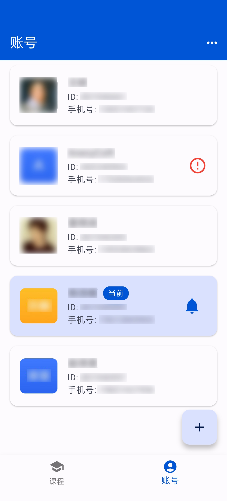
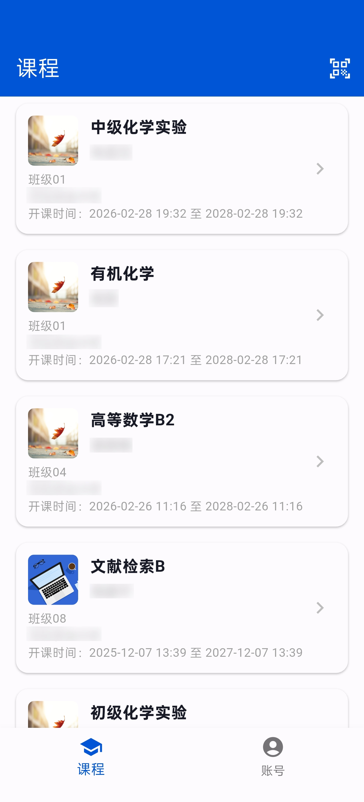
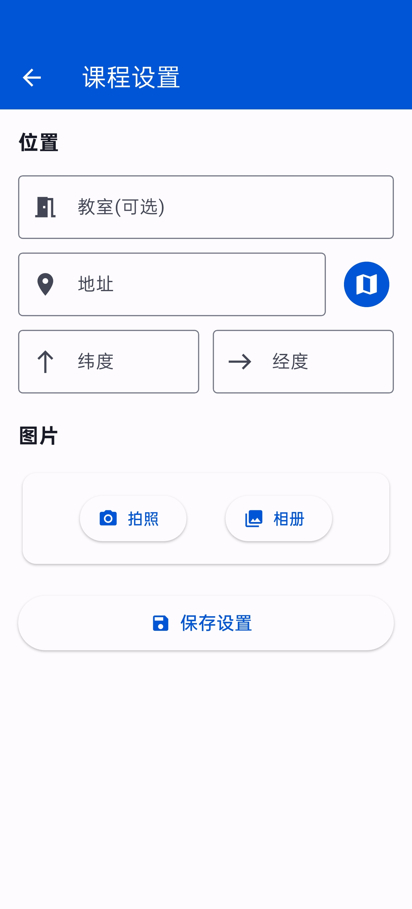
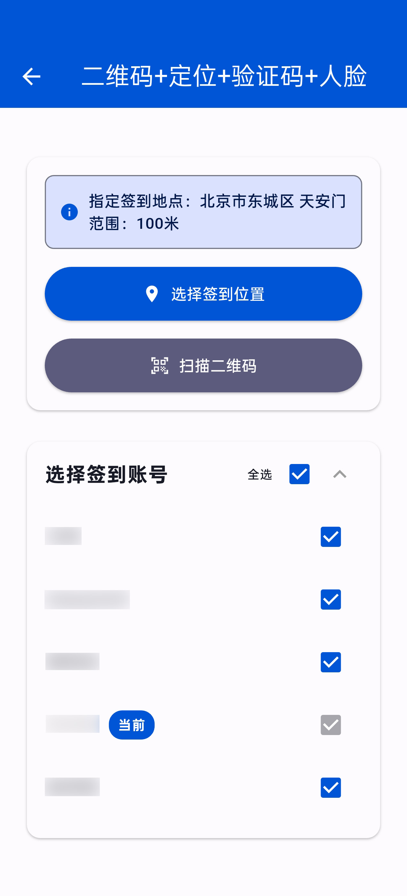

# 课程助手
一个管理学习通、雨课堂课程的应用。
|账号管理|课程列表|课程设置|签到功能|
|---|---|---|---|
|  |  |  |  |

## 功能
- [x] 多账号操作

学习通:
- [x] 签到（所有五种签到任意设置，包括验证码、人脸识别）
- [x] 主题讨论
- [x] 评分
- [x] 投票
- [x] 问卷
- [x] 随堂练习（自动提交答案）
- [ ] 作业
- [x] 群聊签到（查看参与列表）
- [x] IM协议

雨课堂: 
- [x] 动态二维码签到
- [x] PPT展示（查看整个PPT）
- [x] 课堂答题（支持延时提交）

## 平台
| 平台        | 状态    | 说明                       |
|-----------|-------|--------------------------|
| Android   | 可用    | 在 Release 中获取安装包         |
| iOS       | 需自行构建 | 缺少证书，需自行配置后构建            |
| Windows   | 需自行构建 | 部分功能（如扫描二维码）暂不可用         |
| HarmonyOS | 需自行构建 | 可使用 HarmonyFlutterSDK 构建 |

## 致谢
- [Yuuki](https://github.com/SoyBeanMilkx) 提供学习通脱壳包
- [CookiesHax](https://github.com/CookiesHax) 提供基础数据包

## 声明
课程助手仅用于学习，开发者不承担任何责任。

本项目采用 GNU General Public License v3.0进行许可。
您有权使用、修改和分发本代码，但必须严格遵守 GPL v3 的条款。任何分发行为（包括但不限于提供二进制文件、托管源码、作为服务运行）都必须同时提供完整的对应源代码，并保留原始版权声明。

请注意： 违反 GPL 协议可能导致法律诉讼。如果您不确定自己的使用方式是否符合协议，请查阅 GPL v3 官方全文 或咨询法律专业人士。
